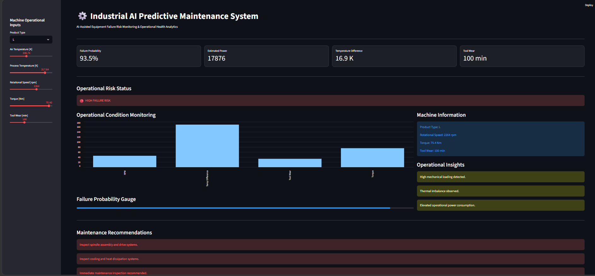

# Industrial AI Predictive Maintenance System

AI-powered predictive maintenance framework for industrial equipment using machine learning, operational analytics, and explainable AI techniques.

---

## Overview

This project develops an industrial predictive maintenance system capable of identifying machine failure risks using operational sensor data and machine learning models.

The workflow combines:
- industrial exploratory analysis
- physics-informed feature engineering
- imbalance-aware evaluation
- threshold optimization
- explainable machine learning
- interactive AI-powered monitoring application development

to simulate predictive maintenance workflows commonly used in Industry 4.0 and smart manufacturing environments.

---


## Interactive Monitoring Application

An interactive Streamlit application was developed to simulate an AI-assisted industrial monitoring system for predictive maintenance.

The application enables:
- real-time machine risk prediction
- operational health monitoring
- failure probability estimation
- maintenance recommendation generation
- interactive sensor input simulation

The system transforms machine learning outputs into actionable operational insights for maintenance and reliability teams.


---

## Problem Statement

Unexpected equipment failures in industrial systems can result in:
- production downtime
- increased maintenance costs
- operational inefficiencies
- safety risks

The objective of this project is to proactively identify machine failure conditions using historical machine sensor data and operational machine learning techniques.

---

## Dataset

### AI4I 2020 Predictive Maintenance Dataset
Source: UCI Machine Learning Repository

The dataset contains 10,000 industrial operating records including:
- Air temperature
- Process temperature
- Rotational speed
- Torque
- Tool wear
- Product quality categories
- Failure indicators

Failure conditions include:
- Tool Wear Failure (TWF)
- Heat Dissipation Failure (HDF)
- Power Failure (PWF)
- Overstrain Failure (OSF)
- Random Failure (RNF)

---

## Exploratory Data Analysis

The exploratory analysis focused on identifying operational conditions associated with machine failures.

### Key Insights
- Higher tool wear strongly correlates with machine failures
- Failure regions commonly occur under high torque and low RPM operating conditions
- Failure behavior appears nonlinear and interaction-driven
- Engineered operational indicators provide stronger predictive separation than raw variables
- Severe class imbalance makes recall-focused evaluation essential for predictive maintenance systems

---

## Feature Engineering

Physics-informed operational indicators were engineered to better represent industrial machine behavior.

### Engineered Features

### Temperature Difference

```math
\Delta T = T_{process} - T_{air}
```

### Estimated Mechanical Power

```math
P = \tau \cdot \frac{2\pi n}{60}
```

These engineered features improve representation of:
- thermal efficiency
- mechanical loading
- operational stress conditions

---

## Machine Learning Workflow

### Preprocessing
- Ordinal encoding for product quality categories
- Train-test split with stratification
- Feature scaling for linear models
- Multicollinearity analysis

### Models Evaluated
- Logistic Regression
- Decision Tree Classifier
- Random Forest Classifier

### Imbalance Handling Experiments
- Class weighting
- SMOTE oversampling
- Threshold optimization

### Evaluation Metrics

Due to class imbalance, model evaluation focused on:
- Precision
- Recall
- F1-score
- ROC-AUC

Special emphasis was placed on recall because missed machine failures are operationally costly in predictive maintenance systems.

---

## Model Optimization & Findings

Multiple optimization strategies were experimentally evaluated.

### Key Findings
- Random Forest consistently outperformed Logistic Regression and Decision Tree models
- Threshold optimization produced more meaningful improvements than SMOTE oversampling
- SMOTE improved recall but introduced excessive false positives
- Hyperparameter tuning improved Random Forest generalization capability
- Engineered operational features significantly improved predictive performance

### Final Selected Configuration
- Tuned Random Forest Classifier
- Optimized operational threshold: `0.40`

### Final Model Performance

| Metric | Score |
|---|---|
| Precision | 0.904 |
| Recall | 0.776 |
| F1 Score | 0.835 |
| ROC-AUC | 0.984 |

The final configuration achieved a strong operational balance between:
- failure detection capability
- false alarm reduction
- industrial reliability

---

## Explainable AI

Model interpretability was improved using:
- Random Forest Feature Importance
- SHAP (SHapley Additive exPlanations)

### Important Operational Drivers
- Estimated Mechanical Power
- Rotational Speed
- Torque
- Temperature Difference
- Tool Wear

The dominance of engineered features validated the effectiveness of domain-informed industrial feature engineering.

---

## Tech Stack

- Python
- Pandas
- NumPy
- Matplotlib
- Seaborn
- Scikit-learn
- SHAP
- Jupyter Notebook
- Streamlit

---

## Repository Structure

```text
industrial-ai-predictive-maintenance/
│
├── data/
├── notebooks/
├── dashboard/
├── models/
├── reports/
├── screenshots/
├── app/
│   └── streamlit_app.py
├── README.md
├── requirements.txt
└── .gitignore
```

---

## Current Workflow

1. Industrial Data Understanding  
2. Exploratory Data Analysis  
3. Physics-Informed Feature Engineering  
4. Data Preprocessing & Scaling  
5. Baseline Model Evaluation  
6. Imbalance Handling Experiments  
7. Threshold Optimization  
8. Hyperparameter Tuning  
9. Explainable AI & Interpretability  
10. Production Configuration Selection
11. Streamlit Application Development
12. Interactive Risk Monitoring

---

## Explainable AI
## Streamlit Application Features

The project includes an interactive Streamlit-based industrial monitoring application.

### Key Features
- Real-time equipment failure prediction
- Dynamic operational risk monitoring
- Interactive machine parameter inputs
- Automated feature engineering
- Maintenance recommendation system
- Failure probability visualization
- Operational condition monitoring

### Operational Inputs
The application accepts:
- Product Type
- Air Temperature
- Process Temperature
- Rotational Speed
- Torque
- Tool Wear

### Generated Operational Indicators
- Temperature Difference
- Estimated Mechanical Power
- Failure Probability
- Risk Classification

---

## Future Improvements

Planned extensions include:
- XGBoost implementation
- LightGBM experimentation
- Predictive maintenance dashboard
- Cloud deployment of Streamlit application
- Maintenance recommendation engine
- Real-time monitoring simulation
- Remaining Useful Life (RUL) estimation
- IoT sensor integration

---

## Application Preview

### Industrial AI Monitoring Interface



---

## Author

**Sahil Singh Shekhawat**  